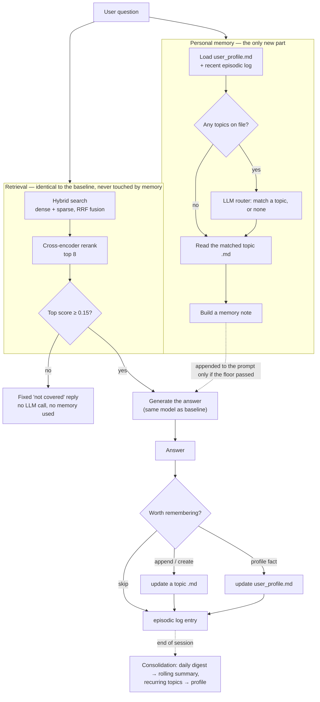

# Personalize-AI

A knowledge-base chatbot that remembers who it's talking to.

This repo takes an existing RAG (retrieval-augmented generation) pipeline and
adds a personal memory layer on top of it — a profile of the user, notes on
topics they've asked about before, and a daily log of what happened. The goal
was to answer one question honestly: **does adding memory actually make the
assistant better, or does it just add moving parts?**

To answer that, this repo is built to be benchmarked directly against the
plain version of the same pipeline, with memory as the *only* thing that
differs between them:

**Baseline (no memory):** [AI-KM-Agent_BaseCase](https://github.com/Nattawat1409/AI-KM-Agent_BaseCase)
**This repo (baseline + memory):** you are here

---

## The result, up front

Same 22-turn scripted conversation, same knowledge base, same generation
model (`gemini-2.5-flash`) for both systems — the only difference is whether
memory is switched on. Judged by `gemini-2.5-pro` as a blind pairwise judge.

| Metric | Baseline | +Memory | What it means |
|---|---|---|---|
| **Win-rate** (head-to-head, judged blind) | — | **65.0%** (W8 / T10 / L2) | The memory version wins more often than it loses |
| **Cross-session recall** (asked to recall an earlier session) | 0% | **66.7%** | Baseline *can't* remember by design — memory got 2 of 3 recall questions right |
| **Wrong-memory rate** (invents or misremembers something about the user) | 5.3% | 5.3% | Memory didn't make things up more than the baseline already does |
| **Recall@8** (retrieval quality, guardrail) | 41.2% | 41.2% | Identical — memory doesn't touch the retrieval step at all |

Retrieval returned the exact same documents in both systems on 17/17
questions — confirmation that memory really is the only variable here, not a
side effect of something else changing.

**Is this result solid, or did it get lucky with question order?** The same
benchmark was run 3 times with the questions shuffled into different orders
each time, to check whether the numbers hold up:

| Metric | Mean across 3 runs | Spread (min–max) | Reading |
|---|---|---|---|
| Win-rate | 65.8% | 65.0% – 67.5% | Stable — not an order artifact |
| Recall@8 (both systems) | 41.2% | 41.2% – 41.2% | Perfectly stable, as it should be |
| Cross-session recall (+memory) | 55.6% | 33.3% – 66.7% | Swings a lot — this is measured off only 3 questions per run, so treat it as "usually gets 2 of 3," not as a precise percentage |
| Wrong-memory rate (baseline) | 8.8% | 5.3% – 10.5% | The judge itself isn't fully consistent on this one — don't read single-run numbers as exact |

Full numbers, per-turn detail, and every judge verdict are in
[`test/eval/eval3_round/`](test/eval/eval3_round/).

---

## How it works



The short version: retrieval works exactly like the baseline and never sees
memory. Memory only enters by adding a short note to the prompt right before
the answer is generated — and only if the knowledge base actually had
something to say. After answering, a small model decides whether the turn was
worth keeping, and files it accordingly. A session boundary triggers a
lightweight consolidation step that turns daily activity into a running
summary and — only if the same subject came up on 3+ different days — a
"recurring interest" note on the profile.

**Not in this repo:** BM25 keyword search, metadata filtering, taxonomy
pruning, and freshness scoring are part of a larger target architecture for
the production system (Cimie), not this benchmark. See
[docs/ARCHITECTURE.md](docs/ARCHITECTURE.md) if you want the full target
design — this repo deliberately keeps retrieval untouched so the memory
comparison stays clean.

---

## Setting it up

You'll need [uv](https://docs.astral.sh/uv/) and a Pinecone index + Google AI
Studio key with access to the same knowledge base the baseline repo uses.

```bash
git clone https://github.com/Nattawat1409/Personalize-AI.git
cd Personalize-AI
uv sync
```

Create a `.env` file in the repo root:

```bash
PINECONE=pcsk_...          # your Pinecone API key
GOOGLE_API_KEY=...         # Google AI Studio key (used for both embeddings and generation)
EMBEDDING_MODEL=models/gemini-embedding-001   # optional — this is already the default
```

`.env` is gitignored and this repo never reads, prints, or edits it beyond
loading it at startup — treat those two keys as yours to manage.

### Try it yourself

```bash
uv run python code/km_chat.py --user demo
```

Chat normally. Commands inside the session:

| Command | Does |
|---|---|
| `/mem` | Show everything memory currently holds about this user |
| `/end` | End the session now (triggers consolidation on demand, instead of waiting for the next day) |
| `/reset` | Wipe this user's memory clean |
| `exit` | Quit |

Add `--no-memory` to talk to the plain baseline behavior instead (useful for
seeing the difference side by side).

### Run the tests

```bash
uv run python test/test_user_isolation.py
```

No network calls — checks that one user's memory can never leak into another
user's answers.

### Reproduce the benchmark

Running the full benchmark calls Pinecone and Gemini for real, so it takes a
few minutes and isn't free. Two repos are involved: this one, and the
[baseline repo](https://github.com/Nattawat1409/AI-KM-Agent_BaseCase), which
needs to be cloned separately and pointed at the same evalset file.

```bash
# kill-switch check first — with memory off, this must reproduce
# the baseline's numbers exactly (confirms "retrieval identical on 17/17")
MEMORY_ENABLED=false uv run python test/eval/run_benchmark.py

# the real run, with memory on
uv run python test/eval/run_benchmark.py

# score both systems against each other
uv run python test/eval/score_benchmark.py \
  --baseline <path to the baseline repo's results file> \
  --personalize <path to the .jsonl this repo just produced>
```

`score_benchmark.py` refuses to compare two runs if their retrieval config,
prompt, models, or evalset don't match exactly — that guard is what makes the
result trustworthy rather than a coincidence of two different setups.

---

## What's in here

```
code/                       the app itself
  config/, tools/general/   retrieval config and helpers — kept byte-identical to the baseline
  nodes/general/            baseline prompt + query-language helpers — also kept identical
  service/graph_llm.py      baseline answer flow, with one hook where memory gets injected
  service/memory_service.py     read memory → answer → write memory back
  service/memory_consolidation.py   the "nightly" summarisation step
  repository/memory_repository.py   reads/writes each user's memory files on disk
  nodes/memory/             the small model calls memory needs (routing, deciding what to keep)
  km_chat.py                talk to it yourself
test/
  eval/                     the benchmark: evalset, runner, scorer, results
  test_user_isolation.py    memory isolation tests
data/memory/users/<id>/     where a user's memory actually lives (gitignored — created at runtime)
docs/                       design history and the target (v2) architecture for Cimie
```

A user's memory is just files: a `user_profile.md`, an index of topics with
one `.md` per topic, and a dated log under `episodic/`. Nothing here needs a
database — reading a repo's `data/memory/users/<id>/` folder tells you
exactly what the assistant "knows" about that person.

---

## Honest limitations

- Tested on one scripted user, 22 turns, one knowledge-base domain (Thai
  cement/manufacturing). Treat the numbers above as a signal, not proof.
- Cross-session recall and wrong-memory rate are measured off very few
  questions per run — they swing more between runs than win-rate or Recall@8
  do. See the "did it get lucky" table above before quoting a single number.
- Memory adds latency: answering takes longer than the baseline (memory has
  to be read before answering), and writing the memory update back after
  answering adds more time on top of that.
- Memory is injected by adding a note to the same system prompt the baseline
  uses, with explicit instructions on how it relates to the baseline's "only
  answer from the retrieved context" rule. Whether that counts as "just
  memory" or as also being a small prompt change is a fair question — flagged
  here rather than glossed over.
