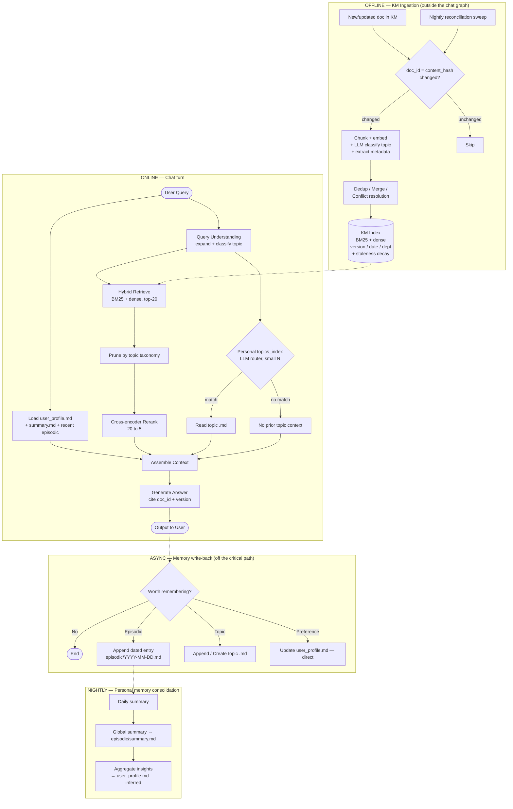

# ARCHITECTURE — Personalize-AI → Cimie

Target architecture for applying the Personalize-AI memory concept to **Cimie**,
the company's production AI chatbot.

**Status of the two tracks:**

| Track | Doc | State |
|---|---|---|
| **v1 — POC** (prove the concept works) | [design.md](design.md) + [PLAN.md](PLAN.md) | ✅ Built and passing acceptance tests |
| **v2 — Cimie production** (this document) | this file + [PLAN-v2.md](PLAN-v2.md) | 📐 Designed, not built |

v2 is **not a rewrite** of v1. The v1 personal-memory pipeline survives almost
intact; v2 adds a second, separate memory system beside it and changes how
writes are consolidated.

---

## 1. Why v1 cannot go to production as-is

Three production realities break the POC design:

| Cimie reality | What breaks in v1 |
|---|---|
| **1,500+ KM documents** | The LLM router puts every topic into one prompt each turn. `ROUTER_MAX_TOPICS = 150` is already the cap, and 150 is generous. At 1,500 the prompt explodes — slow, expensive, inaccurate. |
| **New documents every day** | v1 has no ingestion path at all. Memory only grows from conversation. |
| **Duplicate file/topic names, different content** | v1 keys topics by slugified title. Two KM docs named "Cement Mix Spec" from different departments would collide or be indistinguishable to the router. |

Underneath all three sits one root cause, named directly by the Huawei survey
(arXiv 2504.15965).

---

## 2. Core insight: two memory types, two lifecycles

The Huawei survey classifies AI memory on three dimensions — **object**, **form**,
**time** — producing eight quadrants. The dimension that matters most here is
**object**:

| | **Personal memory** | **System memory** |
|---|---|---|
| Whose | One user | Shared by everyone |
| Origin | Grows from conversation | Authored by humans, ingested |
| Volume | Tens of topics | 1,500+ documents, growing daily |
| Update | Written by the agent, per turn | Written by an external pipeline |
| Truth decays? | No — identity facts stay true | Yes — specs get superseded |
| In our system | `topics_index.json`, topic `.md`, `episodic/`, `user_profile.md` | **KM Index (new)** |

**These must never share an index.** v1 has only personal memory; the mistake to
avoid is pouring 1,500 KM docs into `topics_index.json`, which would destroy
both — the router stops working *and* personal memory gets buried in company
documents.

Every other decision in this document follows from that split.

---

## 3. Memory layers

| Layer | Type (Huawei quadrant) | Store | Written by | Read |
|---|---|---|---|---|
| KM documents | System, non-parametric, long-term | KM Index (hybrid) | Offline ingestion | Every turn (retrieved) |
| Topic notes | Personal, non-parametric, long-term | `business_logic/` `python_topic/` `general/` | `create_md` / `append_md` | On router match |
| **Episodic log** *(new)* | **Personal, non-parametric, long-term — Quadrant II** | `episodic/YYYY-MM-DD.md` | Async write-back | Recent N days, every turn |
| **Consolidated summary** *(new)* | Personal, consolidated episodic | `episodic/summary.md` | Nightly job | Every turn |
| User portrait | Personal, semantic | `user_profile.md` | Direct write + nightly aggregate | Every turn |

---

## 4. Architecture



Note where **decay lives**: inside the KM Index only. The nightly personal-memory
job consolidates but never forgets. §7 explains why.

---

## 5. Component specifications

### 5.1 KM Index — system memory (new)

**Identity — two ids, not one.** The filename is never an identifier. But a
single content hash is not enough either: hashing content alone means that
editing a document changes its id, so it becomes a "new" document and every
earlier citation silently breaks. Identity and revision must be separate fields.

| Field | Stable across edits? | Purpose | Shown to user? |
|---|---|---|---|
| `doc_uid` | ✅ yes | The document's identity — citations, dedup, `superseded_by` links | ❌ internal |
| `content_hash` | ❌ changes on every edit | Change detection: decides whether to re-index | ❌ internal |
| `title`, `version`, `source_path` | — | What a human reads in the citation | ✅ displayed |

`doc_uid` comes from the KM system's own document id when one exists; otherwise
it is assigned at first ingest and stored. Two files both named
`cement-mix-spec.pdf` get different `doc_uid`s and coexist cleanly; the same file
re-uploaded unchanged matches on `content_hash` and is skipped.

**Required metadata per chunk:**

```json
{
  "doc_uid": "km-4471",
  "content_hash": "sha256:a91f...",
  "chunk_id": "km-4471#003",
  "source_path": "KM/production/cement-mix-spec.pdf",
  "title": "Cement Mix Spec",
  "version": "2024-R3",
  "effective_date": "2024-11-01",
  "department": "Production",
  "category": "business_logic",
  "superseded_by": null,
  "last_accessed": "2026-08-29T10:00:00Z",
  "access_count": 47,
  "freshness_score": 1.0
}
```

`superseded_by`, `effective_date` and `version` are what let the system prefer
the *current* document when several share a title — **and equally, what lets a
user ask for an older one on purpose** (§5.5). `last_accessed` / `access_count`
feed `freshness_score`, recomputed nightly and used only as a ranking multiplier.

**Citation format returned with an answer** (max `SOURCES_TOP_K = 5`):

```json
{
  "doc_uid": "km-4471",
  "title": "Cement Mix Spec",
  "version": "2024-R3",
  "source_path": "KM/production/cement-mix-spec.pdf",
  "score": 0.91
}
```

`content_hash` is deliberately absent — it identifies one revision, not the
document, and is meaningless to a reader. Sources are deduped on `doc_uid`, so
two revisions of the same document collapse to one citation (newest wins).

**Retrieval pipeline — four stages, in order:**

1. **Query understanding** — expand the query, classify it into the topic
   taxonomy, and **extract any version/recency intent** ("2020", "the old spec",
   "latest") into a metadata filter.
2. **Metadata filter** — apply that filter if one was extracted. This runs
   *before* scoring, which is what makes an explicit request for an older
   revision immune to staleness decay (§5.5).
3. **Hybrid retrieve, top-20** — BM25 (sparse) ∪ dense vectors. BM25 matters
   disproportionately here: SCG product codes, cement grade names and part
   numbers are exact-token matches that dense embeddings blur.
4. **Taxonomy prune** — drop candidates whose category conflicts with the
   query's classified topic. This is the Ped100x technique (§6).
5. **Cross-encoder rerank, 20 → 5** — the stage that actually resolves
   same-name-different-content, because it reads the *content* against the
   query rather than trusting titles or vector proximity.
6. **Freshness multiplier** — apply `freshness_score` last, as a tie-breaker on
   the reranked scores. Never as a filter (§5.5).

Answers cite `doc_uid` + `version` so a wrong retrieval is diagnosable.

### 5.2 Personal memory — mostly unchanged from v1

`topics_index.json` and the three category folders keep working exactly as
built. The LLM router stays: it only ever sees this user's topics (tens, not
thousands), which is well inside its comfortable range, and it handles
continuation nuance better than cosine similarity.

Unchanged from v1 and still required:
- Router `matched_id` validated against the index before touching a path
- Atomic writes (temp file → `os.replace()`)
- `one_liner` refreshed whenever a summary is compressed

### 5.3 Episodic layer (new)

```
app/memory/episodic/
  2026-08-29.md     # dated log of the day's turns
  2026-08-30.md
  summary.md        # rolling global summary, rewritten nightly
```

Answers the questions v1 structurally cannot: *"what did we discuss yesterday?"*,
*"what have I been asking about this week?"* — and supplies the raw material
that finally lets `Recurring Interests` in the portrait be populated.

### 5.4 Nightly jobs

| Job | Target | Action |
|---|---|---|
| Daily summarisation | `episodic/*.md` → `summary.md` | Hierarchical: daily → global (MemoryBank) |
| Portrait aggregation | `summary.md` → `user_profile.md` | Infer recurring patterns; write only above a confidence threshold |
| **KM staleness decay** | KM Index | Recompute `freshness_score` — see §5.5 |
| KM reconciliation | KM folder ↔ index | Content-hash sweep to catch missed ingestion events |

### 5.5 Staleness decay — a ranking signal, nothing more

Decay is the most easily misapplied idea in this document. Three things it is
**not**:

| ❌ Not | ✅ Actually |
|---|---|
| Part of ingestion/preprocessing | Applied at **ranking** time |
| Deletion or removal from the index | Every document stays retrievable forever |
| A filter that excludes results | A **multiplier on the ranking score** only |

**Where it runs.** The nightly job precomputes a `freshness_score` per document
from `effective_date`, `last_accessed` and `access_count`. Retrieval multiplies
that into the relevance score. Nothing is computed per query, and nothing is
removed.

**Weight ceiling.** Decay must always rank below relevance. If an old document
matches the question exactly and a new one barely matches, the old one must
still win. Decay breaks near-ties; it never overturns a clear relevance gap.

#### The explicit-version case

A user asking for a *specific* older revision is the case that proves the design.
Version intent in the query bypasses decay entirely, because query understanding
converts it into a metadata filter **before** ranking:

| Query | Filter applied | Winner | Why |
|---|---|---|---|
| "cement mix ratio" | none | **2024-R3** | No version signal → decay breaks the tie toward current |
| "cement mix ratio **2020**" | `effective_date ∈ 2020` | **2020** | 2024 filtered out before ranking — decay never runs |
| "the **old** cement mix spec" | `superseded_by IS NOT NULL` | **2020** | Same mechanism, different signal |

**`superseded_by` marks, it does not hide.** A superseded document remains fully
retrievable; the answer simply annotates it — *"this revision was superseded by
2024-R3"* — so the user gets what they asked for plus the context to judge it.

Stated as one rule: **decay may lower a rank, never remove an option.**

---

## 6. Research provenance

Every technique above traces to one of four papers, so choices can be defended
rather than asserted.

| # | Technique | Source | Why it applies |
|---|---|---|---|
| 1 | **Cross-encoder reranking** | LiveRAG (2507.04942) | **All** teams among 70 used a reranker. Highest return per unit of effort; directly resolves same-name-different-content. |
| 2 | **Hybrid BM25 + dense** | LiveRAG | Most teams. Exact-token recall for SCG product codes. |
| 3 | **Topic taxonomy pruning** | LiveRAG — team **Ped100x (SCBX, Thailand), 3rd place** | Classified docs into a predefined taxonomy, then pruned results by question topic. Validates that our 3-category design is the right shape. |
| 4 | LLM-based reranker | LiveRAG — RMIT-ADMS, 1st place | Optional upgrade over cross-encoder if latency budget allows. |
| 5 | **3-layer memory** (raw → summary → portrait) | MemoryBank (2305.10250) | v1 has only the portrait layer. |
| 6 | **Hierarchical summarisation** (daily → global) | MemoryBank | Bounds growth better than v1's flat `COMPRESS_AT_CHARS = 8000`. |
| 7 | **Dynamic personality understanding** → portrait aggregation | MemoryBank | Portrait built by *aggregating logs periodically*, not only by direct writes mid-conversation. |
| 8 | **Personal vs system memory split** | Huawei survey (2504.15965) — object dimension | The single most important decision for Cimie. |
| 9 | **Episodic memory = Quadrant II** | Huawei survey | Personal + non-parametric + long-term: *"retention beyond session limits… recall past user interactions for personalization."* |
| 10 | **Dedup / merge / conflict resolution** | Huawei survey §management | Must be an explicit ingestion node, not left to retrieval luck. |
| 11 | RMM — prospective + retrospective reflection | Huawei survey | Future: tune retrieval from feedback signals. |
| 12 | **Incremental indexing** | Context Engineering survey (2507.13334, §5.1.4) | *"adapt to new information without full retraining"* — answers the daily-update question. |
| 13 | Memory hierarchy / paging (MemGPT-style) | Context Engineering survey §4.3.2 | Future: hot/warm/cold tiers when context saturates. |
| 14 | Context compression | Context Engineering survey §4.3.3 | Future: compress retrieved context before the prompt. |

Additional corroboration for the problem statement, Context Engineering survey
§5.1.4: real-time RAG systems show *"poor accuracy with frequently changing
information and decreased efficiency as document volumes grow"* — precisely the
two Cimie conditions.

---

## 7. Deliberately NOT adopted

Recording these matters as much as the adoptions — each was considered and
rejected for a stated reason.

### Ebbinghaus forgetting curve on `user_profile.md` — rejected

MemoryBank's decay is designed for **SiliconFriend, an AI companion**, where
forgetting makes the agent feel human. Cimie is a corporate assistant, where the
same mechanism is a defect:

- Its premise — *"unreferenced for a long time ⇒ probably no longer true"* —
  **holds for documents, not for identity facts.** A user who says "I'm in QA"
  and doesn't mention it for three weeks did not change departments.
- **It contradicts the project's own success criterion.** The v1 acceptance test
  turns on recalling earlier conversation after a restart. Decay risks forgetting
  something the user said days ago — destroying the value proposition.
- **There is no volume problem for it to solve.** `user_profile.md` is one small
  file that is merged and rewritten, never appended without bound.
- **Asymmetric blast radius.** A decay mistake in KM ranks a still-valid document
  slightly lower — recoverable. A decay mistake in the profile makes the system
  forget a fact about the user — a direct hit to trust.

Decay is therefore applied to **KM staleness only**, and even there strictly as a
ranking multiplier that can never remove an option — see §5.5.

### Personality/emotion framing — reframed

MemoryBank infers personality traits and emotional state. For Cimie this is
reframed to **role, department and expertise level** — professionally useful,
and it avoids storing inferred emotional judgements about employees.

### Raw conversation logs inside `user_profile.md` — rejected

Those belong in `episodic/`. The portrait stays short because it is loaded on
every single turn.

---

## 8. Example — `user_profile.md` under v2

```markdown
---
updated_at: 2026-08-29T22:00:00Z
last_aggregated_at: 2026-08-29T02:00:00Z
---

## Identity
- AI engineer, still a beginner — prefers simple explanations (2026-08-21, direct)
- Works primarily on ML/AI tasks (inferred — 5 days of Python, LLM and agent topics)

## Preferences
- Prefers short, bullet-point answers (2026-08-21, direct)
- Always answer in Thai (2026-08-23, direct)
- Asks for code examples before conceptual explanation (inferred — 4/6 Python sessions)

## Recurring Interests
- SCG cement & concrete production (3 times across 4 days)
- Python exception handling & debugging (3 sessions)
```

Two changes from v1: `last_aggregated_at` separates the nightly job's clock from
direct writes, and each line is tagged `direct` or `inferred` so a confident
user statement is never confused with a machine guess.

---

## 9. Open decisions

| # | Decision | Options | Default if unanswered |
|---|---|---|---|
| 1 | Show `(direct)` / `(inferred)` tags in the portrait? | Transparent vs. natural prose | Keep tags — provenance beats prettiness |
| 2 | Inference threshold for `Recurring Interests` | e.g. ≥3 occurrences in 7 days | ≥3 in 7 days; tune from logs |
| 3 | Reranker model | BGE-m3 / Jina-m0 / Cohere-3.5 / LLM-based | Cross-encoder first; LLM reranker only if quality demands it |
| 4 | Episodic retention window loaded per turn | Last 3 / 7 / 14 days | 7 days |
| 5 | Async write-back mechanism | Task queue vs. background thread | Queue, keyed per user (avoids the v1 sync stall) |

---

## 10. Migration path v1 → v2

Ordered by dependency and by value delivered per unit of risk.

| Step | Work | Why this position |
|---|---|---|
| 1 | **Separate the KM index from the personal index** | Structural. Every later step assumes it; retrofitting is expensive. |
| 2 | **Add the reranker** | Highest ROI. Resolves the duplicate-name worry almost on its own. |
| 3 | **Incremental ingestion** (event-driven + nightly sweep) | Makes daily updates real without scanning 1,500 docs per session. |
| 4 | **`doc_id` = content hash + metadata schema** | Prevents the collision class from recurring. |
| 5 | **Episodic layer + nightly consolidation** | Upgrades personalisation quality. |
| 6 | **KM staleness decay** | Pure optimisation. Correctness does not depend on it — and it must never remove a retrievable option (§5.5). |

Steps 1–2 address the stated concerns; 3–4 stop them recurring; 5–6 raise
quality.

---

## References

- **2507.13334** — *A Survey of Context Engineering for Large Language Models* (ICT, CAS)
- **2305.10250** — *MemoryBank: Enhancing Large Language Models with Long-Term Memory* (Sun Yat-Sen Univ.)
- **2504.15965** — *From Human Memory to AI Memory: A Survey on Memory Mechanisms in the Era of LLMs* (Huawei Noah's Ark Lab)
- **2507.04942** — *SIGIR 2025 LiveRAG Challenge Report* (TII / AI71 / Pinecone)
