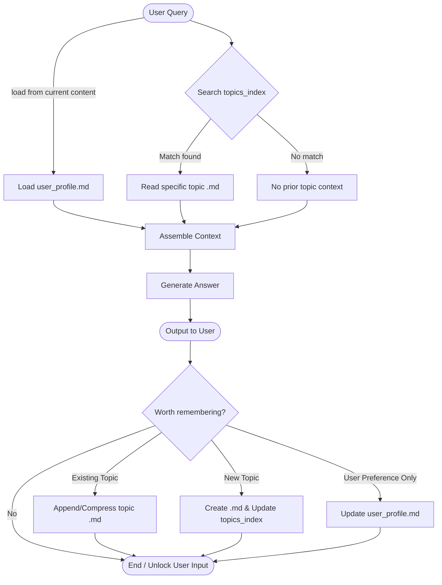

## Memory layout

```
memory/
  topics_index.json          # topic -> {file, category, keywords/embedding}
  user_profile.md            # MD1 — single file, always loaded
  business_logic/
    *.md                     # MD2 — one file per strategy/business-logic topic
  knowledge/
    *.md                     # MD3 — one file per subject/technique topic
```

`topics_index.json` is what `search_memory` checks first — it's the router, so the
agent never has to open every `.md` file to find out what already exists. Each
topic file gets appended/updated in place when the same topic recurs, and
compacted (summarized) once it grows past a size threshold, rather than
growing unbounded.