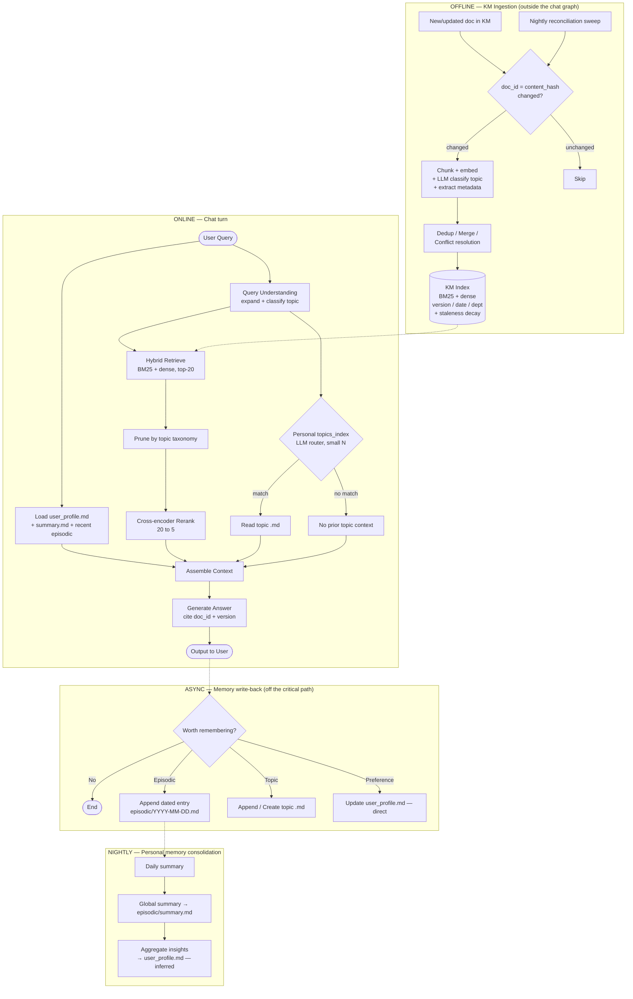

# v2 flow diagram (Cimie)

> Canonical version lives in [ARCHITECTURE.md](ARCHITECTURE.md) §4.
> This file is the standalone diagram, kept for pasting into slides.

**Note on decay:** staleness decay lives in the **KM Index only**. The nightly
personal-memory job consolidates but never forgets — see
[ARCHITECTURE.md](ARCHITECTURE.md) §7 for the reasoning.
