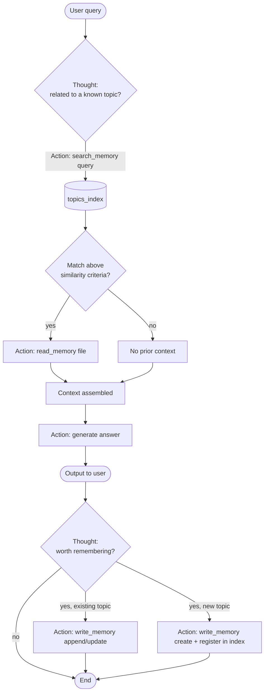

```mermaid
flowchart TD
    start([User query]) --> t1{Thought:<br/>related to a known topic?}
    t1 -->|Action: search_memory query| idx[(topics_index)]
    idx --> t2{Match above<br/>similarity criteria?}
    t2 -->|yes| read[Action: read_memory file]
    t2 -->|no| nocxt[No prior context]
    read --> ctx[Context assembled]
    nocxt --> ctx
    ctx --> gen[Action: generate answer]
    gen --> out([Output to user])
    out --> t3{Thought:<br/>worth remembering?}
    t3 -->|no| finish([End])
    t3 -->|yes, existing topic| append[Action: write_memory append/update]
    t3 -->|yes, new topic| create[Action: write_memory create + register in index]
    append --> finish
    create --> finish
```